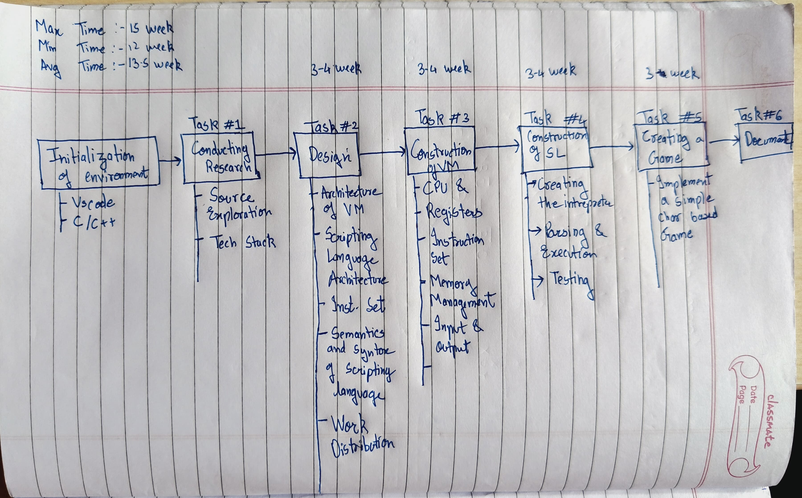

# 16-bit Virtual Console

-   [**Project Initialization and Requirement Gathering**](#project-initialization-and-requirement-gathering)
-   [**System Design and Architecture**](#system-design-and-architecture)
-   [**Technology Stack**](#technology-stack)
-   [Weekly Progress Report](#weekly-progress-report)
    -   [January](#january)
        -   [30.12.24 - 05.01.25](#301224---050125)
        -   [06.01.25 - 12.01.25](#060125---120125)
        -   [13.01.25 - 19.01.25](#130125---190125)
        -   [20.01.25 - 26.01.25](#200125---260125)
-   [Team Members](#team-members)
-   [References](#references)
-   [Placeholders](#placeholders)

# **Project Initialization and Requirement Gathering**

-   Our project revolves around building a 16-bit Virtual Environment to facilitate the creation and execution of programs.

-   **Objectives:**

    -   Develop a virtual environment with components like CPU and Memory.
    -   Implement an instruction set with its own assembler.
    -   Create a programming language basedour instruction set to build applications.

-   **Learning Outcomes:**

    -   Gain a deeper understanding of computer architecture and logical operations.
    -   Explore the inner workings of programming languages.
    -   Apply and enhance low-level programming skills using C.

---

# **System Design and Architecture**

---

# **Technology Stack**

-   **Programming Language:** C
-   **Version Control:** Git
-   **Make System:** GNU Make

---

# Weekly Progress Report

## January

### 30.12.24 - 05.01.25

-   **Group Formation** : Successfully formed a group for PBL.

---

### 06.01.25 - 12.01.25

-   Done with [**Project Initialization and Requirement Gathering**](#project-initialization-and-requirement-gathering)

-   **Achieved :**

    -   [Code at end of week 2](https://github.com/Team-Binary-Brains/16-bit-virtual-gameboy/commit/1bbd7426f1c436f0dff2404d8a22c2ca330e0a05)
    -   @Soham-Metha : Basic working of the assembler with a stack memory.
    -   @Soham-Metha : Specified the code formatting standard.

-   **Next week Target :**
    -   @Soham-Metha : All code is in 1 file, better organization needed.
    -   @omkarjagtap1011 : Start work on the Programming Language.

---

### 13.01.25 - 19.01.25

-   Done with [**Technology Stack Selection**](#technology-stack)

-   **Achieved :**
    -   [Code at end of week 3](https://github.com/Team-Binary-Brains/16-bit-virtual-gameboy/commit/6bce541e890a0599359e99b6135803865898f0b5)
    -   @Soham-Metha : File organization Done
    -   @Soham-Metha : Added Sample Programs and Command Line arguments support for execution
    -   @Soham-Metha : Proper makefile created
    -   @omkarjagtap1011 : Started work on the Programming language.
    -   @omkarjagtap1011 : Lexer created and 20% of the parser is done.
    -   [Code for Programming language at end of week 3](https://github.com/Team-Binary-Brains/16-bit-virtual-gameboy/commit/aafd9f7d0dae4dcbff32331f98aac4cba23612ae)
-   **Next week Target :**

    -   @Soham-Metha : Add documentation for assembler and vm.

    -   @omkarjagtap1011 : Programming language code is all in 1 file, better organization needed.

---

### 20.01.25 - 26.01.25

-   Done with the overall [**System Design and Architecture**](#system-design-and-architecture)

-   **Achieved :**
    -   [Code at end of week 4](https://github.com/Team-Binary-Brains/16-bit-virtual-gameboy/commit/eaef5cfdfd16a75e57768ad89909ba2058cdc758)
    -   @Soham-Metha : Added documentation for the assembler and vm ( roughly 2500 LOC )
    -   @Soham-Metha : Tried switching to Cmake instead of GNU make.
    -   [Code for CMake on "experiment" branch](https://github.com/Team-Binary-Brains/16-bit-virtual-gameboy/tree/experiment)
    -   @omkarjagtap1011 : Refactored the entire lexer code
    -   @omkarjagtap1011 : added a binary tree to the parser
    -   @omkarjagtap1011 : imported the popular [hashmap.h](https://github.com/sheredom/hashmap.h) header file to help with the programming language.
    -   [Code on the Programming Language branch at end of week 4](https://github.com/Team-Binary-Brains/16-bit-virtual-gameboy/commit/0ee9d1c712f0bf46b9851d3ffb7f00996c4a7af7)
    -   Switched to the C99 standard
    -   Iteration 1 completed, working executables uploaded in "releases".
-   **Next week Target :**
    -   @Soham-Metha : Update the instruction set of the assembly language.
    -   @omkarjagtap1011 : Switch from a binary tree to a general tree for the programming language.

---

# Team Members

| Roll No. | Name                 | Working on                     |
| -------- | -------------------- | ------------------------------ |
| 21445    | Diksha Madhe         | the research paper             |
| 21447    | Swarupanand Deshmukh | frontend for pathway generator |
| 21448    | Soham Metha          | assembler and vm               |
| 21454    | Omkar Jagtap         | Programming language           |

# References

-   [Tsoding](https://www.youtube.com/playlist?list=PLpM-Dvs8t0VY73ytTCQqgvgCWttV3m8LM)
-   [Dr Birch](https://www.youtube.com/@dr-Jonas-Birch)
-   [Low Byte Productions](https://www.youtube.com/playlist?list=PLP29wDx6QmW5DdwpdwHCRJsEubS5NrQ9b)
-   [Cobb Coding](https://www.youtube.com/playlist?list=PLRnI_2_ZWhtCxHQ_3zDfW0-RgiWo8ftyj)

# Placeholders

## February

### 27.01.25 - 02.02.25

-   **Target:** *(To be updated)*
-   **Achieved:** *(To be updated)*

### 03.02.25 - 09.02.25

-   **Target:** *(To be updated)*
-   **Achieved:** *(To be updated)*

### 10.02.25 - 16.02.25

-   **Target:** *(To be updated)*
-   **Achieved:** *(To be updated)*

### 17.02.25 - 23.02.25

-   **Target:** *(To be updated)*
-   **Achieved:** *(To be updated)*

## March

### 24.02.25 - 01.03.25

-   **Target:** *(To be updated)*
-   **Achieved:** *(To be updated)*

### 02.03.25 - 08.03.25

-   **Target:** *(To be updated)*
-   **Achieved:** *(To be updated)*

### 09.03.25 - 15.03.25

-   **Target:** *(To be updated)*
-   **Achieved:** *(To be updated)*

### 16.03.25 - 22.03.25

-   **Target:** *(To be updated)*
-   **Achieved:** *(To be updated)*

### 23.03.25 - 29.03.25

-   **Target:** *(To be updated)*
-   **Achieved:** *(To be updated)*

## April

### 30.03.25 - 05.04.25

-   **Target:** *(To be updated)*
-   **Achieved:** *(To be updated)*

### 06.04.25 - 12.04.25

-   **Target:** *(To be updated)*
-   **Achieved:** *(To be updated)*
